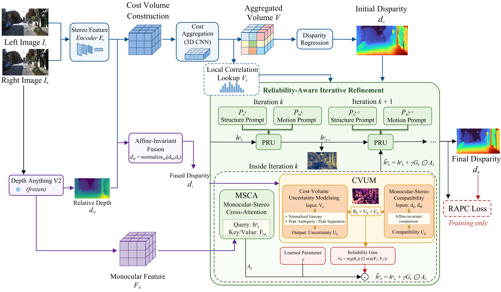
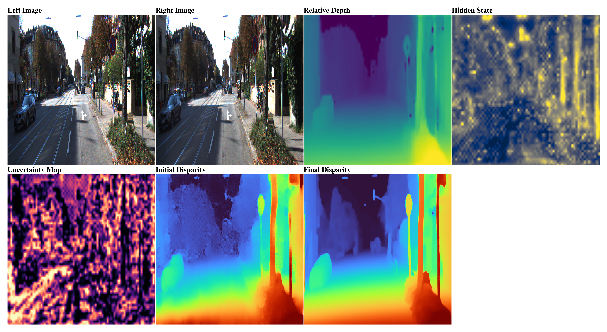
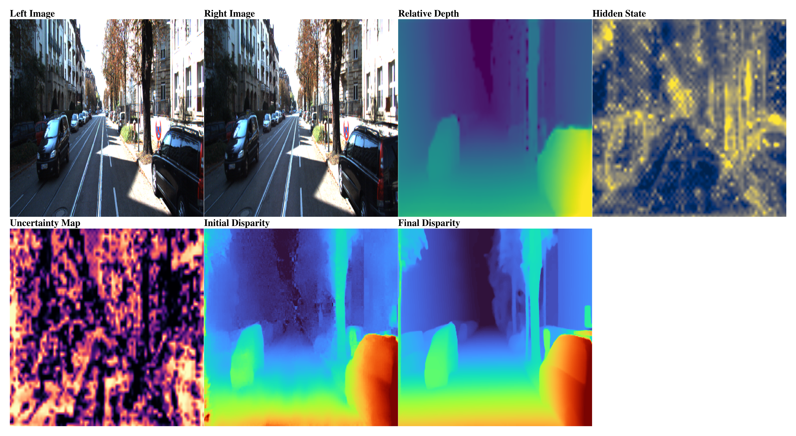
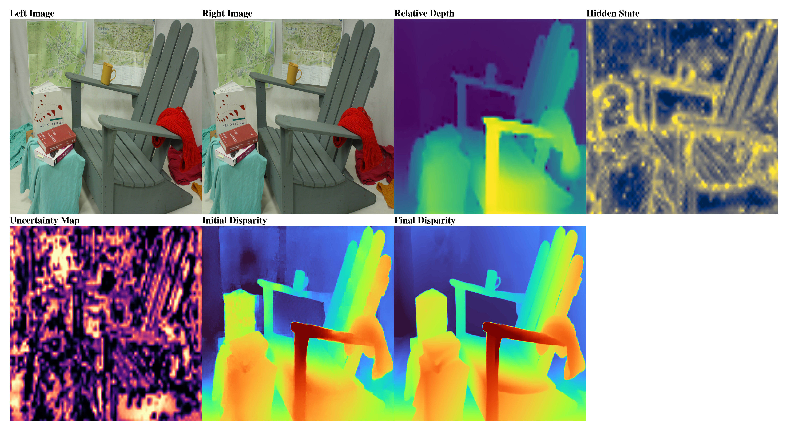
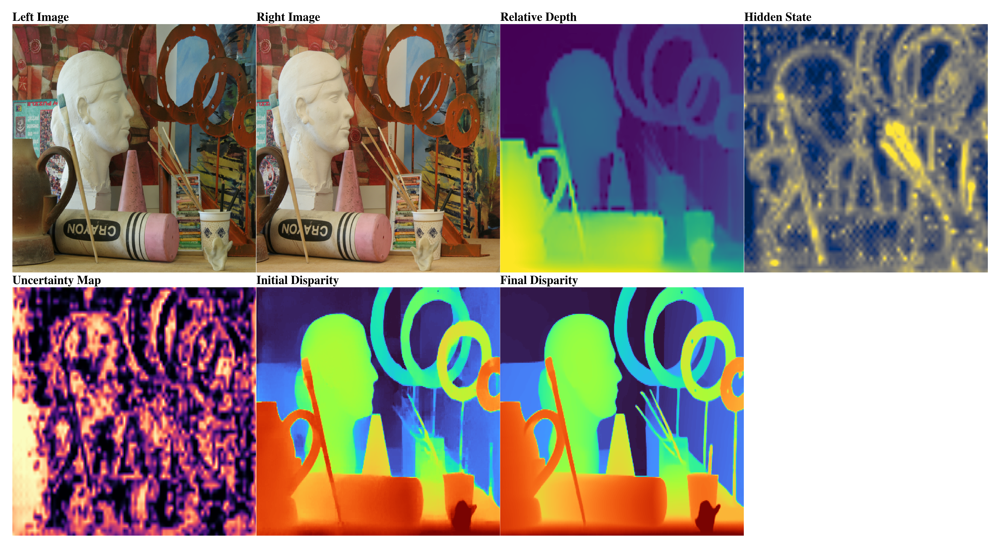
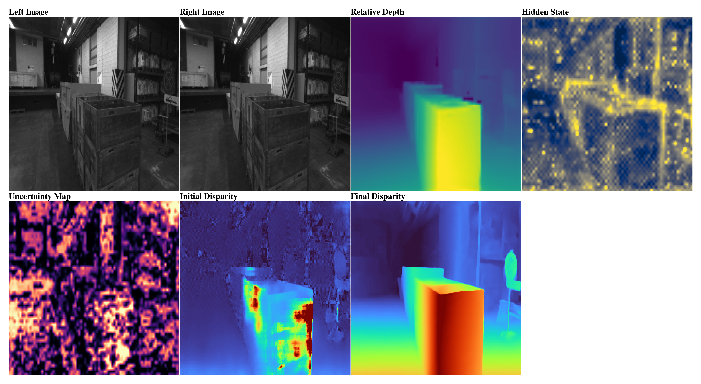
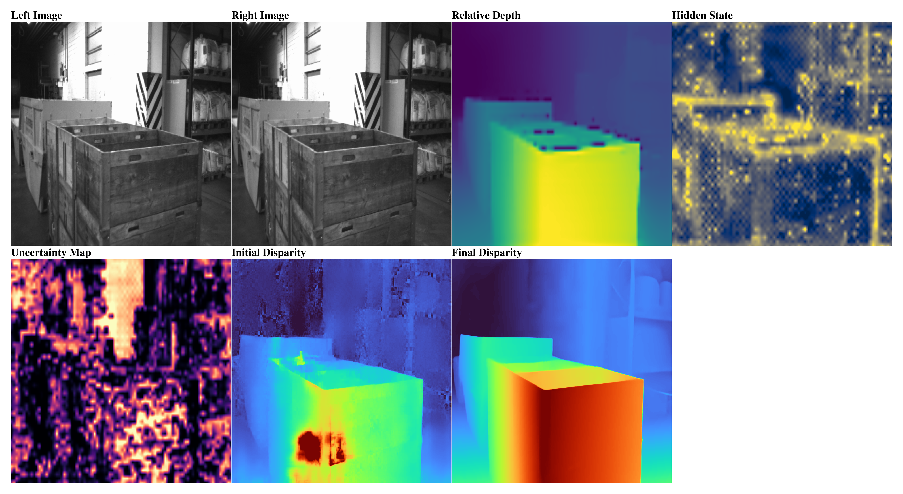

# 🏆RMSI-Stereo: Reliability-Aware Monocular-Stereo Interaction for Generalizable Stereo Matching🏆

Modern stereo matching methods increasingly leverage monocular depth foundation models to improve zero-shot generalization. However, existing approaches mainly focus on how monocular priors are introduced into the stereo pipeline, while the reliability of such priors during iterative disparity refinement remains insufficiently modeled. We propose RMSI-Stereo, a reliability-aware monocular-stereo interaction framework that regulates prior usage according to stereo matching evidence. Specifically, a Monocular-Stereo Cross-Attention module lets stereo hidden states actively retrieve structure-aware information from monocular depth features. Cost-Volume Uncertainty Modeling estimates correspondence ambiguity from the local matching distribution and uses it to control cross-modal interaction. A Reliability-Aware Prior Consistency objective further aligns training with this selective interaction policy. Experiments on multiple stereo benchmarks show that RMSI-Stereo achieves state-of-the-art zero-shot generalization across diverse domains, highlighting reliability-aware monocular-stereo interaction as an effective direction for robust stereo matching.



## Full RMSI-Stereo configuration

The default model config is `config/model/rmsi_stereo.yaml`:

```yaml
use_legacy_structure_prompt: False
msca.enabled: True
cvum.enabled: True
cvum.mode: entropy_peak
rapc.enabled: True
rapc.mode: support
```

The frozen monocular model is Depth Anything V2. A PromptStereo Scene Flow checkpoint may be supplied through `checkpoint=...`; `train_stereo.py` loads all shape-compatible baseline parameters and initializes only the new RMSI-Stereo parameters.

## Single RTX 4090

Use:

```bash
bash start_rmsi_full.sh
```

## Experimental Results






